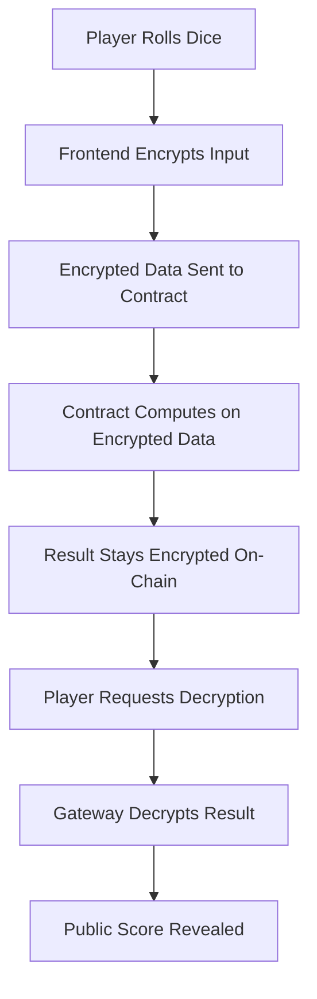

# 🎲 FheZama-Dice: Your First Confidential Dice dApp on FHEVM

[](https://opensource.org/licenses/MIT)
[](https://docs.zama.ai/fhevm)

> **Welcome to the world of Fully Homomorphic Encryption (FHE)!**
> 
> This tutorial will guide you through building your **first confidential dApp** - a dice game where your rolls remain private until you choose to reveal them. Perfect for Web3 developers new to FHEVM who want to understand encrypted computations on-chain.

##  What You'll Build

A fully functional confidential dice game where:
-  Players roll dice privately (encrypted on-chain)
-  Roll results are hidden from other players and even the blockchain
-  Only final scores are revealed when players choose
-  Full encryption → computation → decryption workflow

**Live Demo**: [Try it here](https://fhezamadice.vercel.app/) *(Deploy on Zama Testnet)*

##  Learning Objectives

By the end of this tutorial, you'll:
- ✅ Understand FHEVM basics and why confidential computing matters
- ✅ Set up a complete FHEVM development environment
- ✅ Write and deploy your first FHEVM smart contract
- ✅ Build a React frontend that encrypts/decrypts data
- ✅ Master the full confidential dApp workflow
- ✅ Be ready to build more advanced FHEVM applications

##  Prerequisites

**Perfect for developers who have:**
- Basic Solidity knowledge (can write simple smart contracts)
- Familiarity with React and JavaScript
- Experience with Hardhat or similar tools
- MetaMask installed

**No prior knowledge needed of:**
- Fully Homomorphic Encryption (FHE)
- Cryptography or advanced mathematics
- FHEVM specifics

## Quick Start

### 1. Clone and Install

```bash
git clone https://github.com/Atunde-SS/FheZama-Dice.git
cd FheZama-Dice
npm install
```

### 2. Run in your Local web browser

```bash
npm run dev

# Make sure you are connected to sepolia Network
# MetaMask wallet is installed
```

Visit `http://localhost:3000` and start playing!

## Step-by-Step Tutorial

### Part 1: Understanding FHEVM 

#### What is FHEVM?
FHEVM (Fully Homomorphic Encryption Virtual Machine) allows you to perform computations on encrypted data without ever decrypting it. Think of it as a magic box where:

```
Encrypted Input → Computation → Encrypted Output
     🔐              ⚙️              🔐
```

#### Why Does This Matter?
Traditional blockchains are transparent - everyone can see everything. FHEVM enables:
- **Privacy**: Your data stays encrypted on-chain
- **Confidentiality**: Computations happen without revealing inputs
- **Decentralization**: Still fully decentralized and verifiable

### Part 2: Environment Setup 🔧

#### Install Zama Hardhat Template

The easiest way to get started with FHEVM development:

```bash
# Use the official Zama Hardhat template
npx hardhat init --template https://github.com/zama-ai/hardhat-template

# Or clone directly
git clone https://github.com/zama-ai/hardhat-template.git my-fhevm-project
```

**[Complete Zama Hardhat Template Guide](https://docs.zama.ai/fhevm/getting_started/hardhat)**


**[Or use my well curated resources to begin](https://github.com/Atunde-SS/FheZama-Dice/blob/main/CONTRIBUTE.md)**


**[Or the Hardhat template](https://github.com/zama-ai/fhevm-hardhat-template)**
#### Configure Hardhat for FHEVM

``` bash
configure your wallet 
Infura API key
and (optionally) etherscan API key
```

### Part 3: Smart Contract Development

#### Understanding FHEVM Data Types

FHEVM introduces encrypted data types:

```solidity
import "fhevm/lib/TFHE.sol";

contract Example {
    // Encrypted unsigned integers
    euint8 private smallNumber;    // 0-255
    euint16 private mediumNumber;  // 0-65535
    euint32 private largeNumber;   // 0-4294967295
    
    // Encrypted boolean
    ebool private secretFlag;
}
```

#### The ZamaDice Contract

Let's build our confidential dice game contract:

```solidity
// SPDX-License-Identifier: MIT
pragma solidity ^0.8.24;

import {FHE, euint8, euint64, ebool} from "@fhevm/solidity/lib/FHE.sol";
import {SepoliaConfig} from "@fhevm/solidity/config/ZamaConfig.sol";

/**
 * @title Gzama - FHE Dice Game
 * @notice A confidential dice game using Zama's FHE technology
 * @dev Fixed version with proper FHE permissions and error handling
 */
contract Gzama is SepoliaConfig {
    //═══════════════════════════════════════════════════════════════════════════════════
    //                                 CONSTANTS
    //═══════════════════════════════════════════════════════════════════════════════════
    
    string public constant name = "Zama Dice";
    string public constant symbol = "ZD";
    uint8 public constant decimals = 9;
    
    uint64 private constant INITIAL_TOKENS = 500_000_000_000; // 500 * 10^9
    uint64 private constant NFT_THRESHOLD = 1000_000_000_000; // 1000 * 10^9
    uint64 private constant BASE_REWARD = 25_000_000_000; // 25 * 10^9
    uint8 private constant BOARD_SIZE = 16;
    uint256 private constant MAX_NFT_SUPPLY = 5000;

    //═══════════════════════════════════════════════════════════════════════════════════
    //                                 STATE VARIABLES
    //═══════════════════════════════════════════════════════════════════════════════════
    
    euint64 public totalSupply;
    mapping(address => euint64) public balanceOf;
    mapping(address => Player) public players;
    mapping(uint256 => address) public nftOwnerOf;
    
    uint256 public nftSupply;
    bool private boardInitialized;

    //═══════════════════════════════════════════════════════════════════════════════════
    //                                 STRUCTS & ENUMS
    //═══════════════════════════════════════════════════════════════════════════════════
    
    enum TileType { NEUTRAL, PROFIT, LOSS }
    
    struct Player {
        euint8 position;
        bool hasStarted;
        bool hasMintedNFT;
        uint32 lastAction;
    }
    
    struct Tile {
        TileType tileType;
        uint32 value;
        bytes12 name;
    }
    
    Tile[BOARD_SIZE] private board;

    //═══════════════════════════════════════════════════════════════════════════════════
    //                                 EVENTS
    //═══════════════════════════════════════════════════════════════════════════════════
    
    event Transfer(address indexed from, address indexed to, euint64 value);
    event GameStarted(address indexed player);
    event DiceRolled(address indexed player, euint8 roll);
    event RewardClaimed(address indexed player, euint64 amount);
    event NFTMinted(address indexed player, uint256 tokenId);
    
    //═══════════════════════════════════════════════════════════════════════════════════
    //                                 ERRORS
    //═══════════════════════════════════════════════════════════════════════════════════
    
    error GameNotStarted();
    error AlreadyStarted();
    error NFTAlreadyMinted();
    error MaxNFTSupplyReached();
    error TooSoon();
    
    //═══════════════════════════════════════════════════════════════════════════════════
    //                                 CONSTRUCTOR
    //═══════════════════════════════════════════════════════════════════════════════════
    
    constructor() {
        board[0] = Tile(TileType.PROFIT, 50, bytes12("Start"));
        
        // Initialize total supply as encrypted zero
        totalSupply = FHE.asEuint64(0);
        FHE.allowThis(totalSupply);
    }

    //═══════════════════════════════════════════════════════════════════════════════════
    //                                 CORE GAME FUNCTIONS
    //═══════════════════════════════════════════════════════════════════════════════════
    
    function startGame() external {
        if (players[msg.sender].hasStarted) revert AlreadyStarted();
        
        if (!boardInitialized) {
            _initializeBoard();
            boardInitialized = true;
        }
        
        // Create initial tokens
        euint64 initialTokens = FHE.asEuint64(INITIAL_TOKENS);
        FHE.allowThis(initialTokens);
        
        // Update total supply
        totalSupply = FHE.add(totalSupply, initialTokens);
        FHE.allowThis(totalSupply);
        
        // Set player balance
        balanceOf[msg.sender] = initialTokens;
        FHE.allowThis(balanceOf[msg.sender]);
        
        // Create starting position
        euint8 startPosition = FHE.asEuint8(0);
        FHE.allowThis(startPosition);
        
        players[msg.sender] = Player({
            position: startPosition,
            hasStarted: true,
            hasMintedNFT: false,
            lastAction: uint32(block.timestamp)
        });
        
        // Grant user permissions for their data
        FHE.allow(balanceOf[msg.sender], msg.sender);
        FHE.allow(players[msg.sender].position, msg.sender);
        
        emit GameStarted(msg.sender);
        emit Transfer(address(0), msg.sender, initialTokens);
    }
    
    function rollDice() external {
        Player storage player = players[msg.sender];
        if (!player.hasStarted) revert GameNotStarted();
        
        // Remove cooldown for testing - in production you may want to keep this
        // if (block.timestamp < player.lastAction + 10) revert TooSoon();
        
        // Generate dice roll
        euint8 randomByte = FHE.randEuint8();
        euint8 diceRoll = FHE.add(FHE.rem(randomByte, 6), 1);
        FHE.allowThis(diceRoll);
        
        // Update position
        FHE.allowThis(player.position);
        player.position = FHE.add(player.position, diceRoll);
        FHE.allowThis(player.position);
        
        player.lastAction = uint32(block.timestamp);
        
        // Grant permissions
        FHE.allow(player.position, msg.sender);
        FHE.allow(diceRoll, msg.sender);
        
        emit DiceRolled(msg.sender, diceRoll);
    }
    
    function claimReward() external {
        if (!players[msg.sender].hasStarted) revert GameNotStarted();
        
        euint64 reward = FHE.asEuint64(BASE_REWARD);
        FHE.allowThis(reward);
        
        // Update balances with proper permissions
        FHE.allowThis(totalSupply);
        FHE.allowThis(balanceOf[msg.sender]);
        
        totalSupply = FHE.add(totalSupply, reward);
        balanceOf[msg.sender] = FHE.add(balanceOf[msg.sender], reward);
        
        FHE.allowThis(totalSupply);
        FHE.allowThis(balanceOf[msg.sender]);
        
        // Grant user permission
        FHE.allow(balanceOf[msg.sender], msg.sender);
        
        emit Transfer(address(0), msg.sender, reward);
        emit RewardClaimed(msg.sender, reward);
    }
    
    function mintNFT() external {
        Player storage player = players[msg.sender];
        if (!player.hasStarted) revert GameNotStarted();
        if (player.hasMintedNFT) revert NFTAlreadyMinted();
        if (nftSupply >= MAX_NFT_SUPPLY) revert MaxNFTSupplyReached();
        
        euint64 burnAmount = FHE.asEuint64(NFT_THRESHOLD);
        FHE.allowThis(burnAmount);
        
        // Ensure we have permissions
        FHE.allowThis(balanceOf[msg.sender]);
        FHE.allowThis(totalSupply);
        
        // Burn tokens
        balanceOf[msg.sender] = FHE.sub(balanceOf[msg.sender], burnAmount);
        totalSupply = FHE.sub(totalSupply, burnAmount);
        
        FHE.allowThis(balanceOf[msg.sender]);
        FHE.allowThis(totalSupply);
        
        // Mint NFT
        uint256 tokenId = ++nftSupply;
        nftOwnerOf[tokenId] = msg.sender;
        player.hasMintedNFT = true;
        
        FHE.allow(balanceOf[msg.sender], msg.sender);
        
        emit Transfer(msg.sender, address(0), burnAmount);
        emit NFTMinted(msg.sender, tokenId);
    }

    //═══════════════════════════════════════════════════════════════════════════════════
    //                                 VIEW FUNCTIONS
    //═══════════════════════════════════════════════════════════════════════════════════
    
    function getPlayerPosition(address player) external view returns (euint8) {
        return players[player].position;
    }
    
    function getPlayerBalance(address player) external view returns (euint64) {
        return balanceOf[player];
    }
    
    function getTile(uint8 position) external view returns (
        string memory tileName,
        TileType tileType,
        uint256 value
    ) {
        require(position < BOARD_SIZE, "Invalid position");
        Tile memory tile = board[position];
        return (
            string(abi.encodePacked(tile.name)),
            tile.tileType,
            uint256(tile.value) * 1_000_000_000
        );
    }
    
    function getPlayerStatus(address player) external view returns (
        bool hasStarted,
        bool hasMintedNFT,
        uint32 lastAction
    ) {
        Player memory p = players[player];
        return (p.hasStarted, p.hasMintedNFT, p.lastAction);
    }
    
    function getNFTInfo() external view returns (uint256 currentSupply, uint256 maxSupply) {
        return (nftSupply, MAX_NFT_SUPPLY);
    }

    //═══════════════════════════════════════════════════════════════════════════════════
    //                                 INTERNAL FUNCTIONS
    //═══════════════════════════════════════════════════════════════════════════════════
    
    function _initializeBoard() private {
        board[1] = Tile(TileType.PROFIT, 50, bytes12("Lucky Spin"));
        board[2] = Tile(TileType.LOSS, 20, bytes12("Bad Luck"));
        board[3] = Tile(TileType.NEUTRAL, 0, bytes12("Rest"));
        board[4] = Tile(TileType.PROFIT, 150, bytes12("Jackpot"));
        board[5] = Tile(TileType.LOSS, 50, bytes12("Penalty"));
        board[6] = Tile(TileType.PROFIT, 75, bytes12("Bonus"));
        board[7] = Tile(TileType.LOSS, 30, bytes12("Tax"));
        board[8] = Tile(TileType.PROFIT, 30, bytes12("Mini Win"));
        board[9] = Tile(TileType.PROFIT, 80, bytes12("Treasure"));
        board[10] = Tile(TileType.LOSS, 40, bytes12("Fine"));
        board[11] = Tile(TileType.PROFIT, 100, bytes12("Mega Prize"));
        board[12] = Tile(TileType.LOSS, 25, bytes12("Loss"));
        board[13] = Tile(TileType.PROFIT, 30, bytes12("Gift"));
        board[14] = Tile(TileType.LOSS, 10, bytes12("Fee"));
        board[15] = Tile(TileType.PROFIT, 50, bytes12("Fortune"));
    }

    //═══════════════════════════════════════════════════════════════════════════════════
    //                                 EMERGENCY FUNCTIONS
    //═══════════════════════════════════════════════════════════════════════════════════
    
    function grantPermissions() external {
        if (!players[msg.sender].hasStarted) revert GameNotStarted();
        
        FHE.allow(balanceOf[msg.sender], msg.sender);
        FHE.allow(players[msg.sender].position, msg.sender);
    }
}
```

#### Key FHEVM Concepts Explained:

1. **Encrypted Types**: `euint8`, `euint16` store encrypted integers
2. **TFHE Library**: Provides operations on encrypted data
3. **Gateway Pattern**: Used for decryption requests
4. **Encrypted Randomness**: `TFHE.randEuint8()` for secure random numbers

### Part 4: Frontend Development

#### Check the Example-Site folder for Integration or ZAMA FHE-react template

#### For this game, you can replace CONTRACT ADDRESS with your deployed contract 

```javascript
import Web3 from 'web3';

// Sepolia testnet configuration with multiple RPC endpoints
const SEPOLIA_CONFIG = {
  chainId: "0xaa36a7",
  chainName: "Sepolia",
  nativeCurrency: {
    name: "ETH",
    symbol: "ETH",
    decimals: 18,
  },
  rpcUrls: [
    "https://ethereum-sepolia.publicnode.com",
    "https://rpc2.sepolia.org",
    "https://rpc.sepolia.org",
    "https://sepolia.infura.io/v3/9aa3d95b3bc440fa88ea12eaa4456161"
  ],
  blockExplorerUrls: ["https://sepolia.etherscan.io"],
};

const CONTRACT_ADDRESS = "0xAA89C8E13A0Bb610F5320D022679eAF85495C1C4";

// Smart Contract ABI
const CONTRACT_ABI = [
```

##  Understanding the Magic: Encryption Flow

### How FHEVM Works in Our Dice Game



1. **Encryption**: When you roll, the random number is encrypted client-side
2. **Computation**: Smart contract adds encrypted rolls without seeing values
3. **Storage**: All intermediate results remain encrypted on blockchain
4. **Decryption**: Only when you choose to reveal, the Gateway decrypts your score

##  Key Learning Points

### FHEVM vs Traditional Smart Contracts

| Traditional Contracts | FHEVM Contracts |
|----------------------|-----------------|
| All data is public | Data can be encrypted |
| `uint256 score` | `euint16 encryptedScore` |
| Direct computation | Encrypted computation |
| Immediate results | Decryption requests |

### Best Practices Learned

1. **Use appropriate encrypted types**
2. **Handle async decryption** with Gateway pattern
3. **Balance privacy and functionality** (some data must be public for game logic)
4. **Manage user experience** during encryption/decryption operations

##  What's Next?

Now that you've built your first FHEVM dApp, try these challenges:

### Beginner Challenges
- [ ] Add different dice types 
- [ ] Implement betting mechanics
- [ ] Create tournament brackets

### Intermediate Challenges  
- [ ] Multi-round games with encrypted state
- [ ] Private messaging between players
- [ ] Encrypted inventory systems

### Advanced Challenges
- [ ] Zero-knowledge proof integration
- [ ] Cross-chain confidential bridges
- [ ] Confidential DeFi protocols

##  Additional Resources

### Official Zama Documentation
-  [FHEVM Documentation](https://docs.zama.ai/fhevm) - Complete FHEVM guide
-  [Hardhat Template](https://github.com/zama-ai/hardhat-template) - Official starter template
-  [fhevmjs SDK](https://docs.zama.ai/fhevm/frontend/fhevmjs) - Frontend integration guide

### Community & Support
- [Zama Community Discord](https://discord.gg/zama)
- [Follow @zama_fhe](https://twitter.com/zama_fhe)

### Learning More About FHE
- [What is FHE?](https://docs.zama.ai/what-is-fhe) - Non-technical introduction
- [FHEVM Tutorial Videos](https://www.youtube.com/channel/zama-fhe) - Video tutorials
- [FHE Use Cases](https://docs.zama.ai/use-cases) - Real-world applications

## 🤝 Contributing

We welcome contributions! Here's how to get involved:

1. **Report Issues**: Found a bug? [Open an issue](https://github.com/Atunde-SS/FheZama-Dice/issues)
3. **Submit PRs**: Improvements welcome!
4. **Share Your Build**: Built something cool with this tutorial? Share it!


*Built with ❤️ for the Zama Community*

</div>
